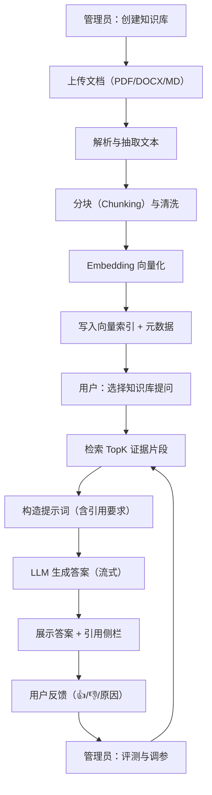

## 1. 产品概述
CitationChat 是一个面向企业内部资料的“可追溯引用”知识库问答系统：支持文档导入与索引、对话式检索增强生成（RAG）、答案引用与证据高亮、以及质量反馈闭环。
- 解决问题：资料分散、查找成本高、答案不可追溯、知识更新难
- 目标用户：需要快速定位制度/方案/技术文档的员工；需要管理知识库与质量的管理员
- 产品价值：提升信息检索效率，降低重复咨询成本；通过引用与反馈提升可信度与可控性

## 2. 核心功能

### 2.1 用户角色
| 角色 | 登录方式 | 核心权限 |
|------|----------|----------|
| 普通用户 | 邮箱+密码 / SSO（预留） | 选择知识库、对话问答、查看引用、提交反馈、查看个人历史 |
| 管理员 | 邮箱+密码 | 管理知识库、上传/删除文档、重建索引、查看质量指标与反馈、配置模型与检索策略 |

### 2.2 功能模块
1. **对话页**：多轮对话、流式输出、引用与证据片段、答案反馈与再生成
2. **知识库页**：知识库列表、创建/编辑、文档上传与解析状态、分块预览、索引管理
3. **评测与设置页**：离线评测集、自动打分与对比、关键配置（模型/Embedding/检索参数/系统提示词）

### 2.3 页面详情
| 页面名称 | 模块名称 | 功能说明 |
|---|---|---|
| 对话页 | 知识库选择器 | 选择当前对话使用的知识库；支持多知识库切换与提示 |
| 对话页 | 对话区（流式） | SSE/WebSocket 流式输出；支持“停止生成/继续生成” |
| 对话页 | 引用侧栏 | 展示 TopK 证据片段：来源文件、页码/段落、相似度；支持点击定位与高亮 |
| 对话页 | 追问与再生成 | 支持“基于引用重新回答”“更简洁/更详细/更偏业务”等快捷指令 |
| 对话页 | 反馈闭环 | 👍/👎、原因选择、可选文本反馈；反馈入库用于评测与调参 |
| 知识库页 | 知识库管理 | 新建/重命名/归档；描述、可见性（个人/团队，预留） |
| 知识库页 | 文档上传 | 支持 PDF/DOCX/MD/TXT；显示解析进度、失败重试；上传后异步切分与向量化 |
| 知识库页 | 分块预览 | 展示 chunk 内容、元数据（文件名、页码、chunk_id）；支持删除特定 chunk |
| 知识库页 | 索引管理 | 一键重建索引；查看索引大小、最近更新时间、Embedding 模型信息 |
| 评测与设置页 | 评测集管理 | 导入 Q/A 或 Q + 参考答案；支持按知识库分组 |
| 评测与设置页 | 自动评测 | 生成答案→与参考对比→输出评分与原因（如准确性/覆盖度/引用充分性） |
| 评测与设置页 | 参数配置 | LLM Provider、模型名、温度、TopK、阈值、chunk_size、系统提示词等 |
| 评测与设置页 | 指标面板 | 命中率、无引用率、用户满意度、平均响应时间、失败率 |

## 3. 关键流程
主要用户流程：
- 管理员创建知识库并上传文档
- 系统解析文档→分块→生成向量→写入向量索引与元数据
- 普通用户选择知识库进行提问
- 系统检索 TopK 证据→构造带引用的提示词→生成答案并展示引用
- 用户反馈进入质量闭环；管理员在评测页对不同参数/模型做对比优化

## 4. 用户界面设计
### 4.1 设计风格
- 整体风格：偏“专业控制台 + 可阅读引用”的深色主题，强调可信度与信息密度
- 主色：深灰/黑（背景）+ 青蓝（强调）+ 柠黄（警示/高亮引用）
- 字体：标题使用具有识别度的展示字体，正文使用高可读衬线/人文无衬线组合（避免默认系统感）
- 布局：左侧导航（知识库/对话/评测），中间对话主区，右侧引用证据侧栏
- 交互：答案生成时的光标与分段出现动画；引用 hover 高亮与一键复制引用

### 4.2 页面设计概览
| 页面名称 | 模块名称 | UI 元素 |
|---|---|---|
| 对话页 | 对话区 | 气泡式消息、流式打字效果、代码块/表格渲染、快捷指令 chips |
| 对话页 | 引用侧栏 | 证据卡片（来源、页码、相似度）、点击定位、证据片段高亮 |
| 知识库页 | 上传与状态 | 拖拽上传、任务进度条、失败原因提示、重试按钮 |
| 评测与设置页 | 指标面板 | 关键指标卡、趋势图（可选）、参数表单与即时预览 |

### 4.3 响应式
桌面优先；在窄屏下将引用侧栏折叠为抽屉（Drawer），保留对话可用性与可读性。
