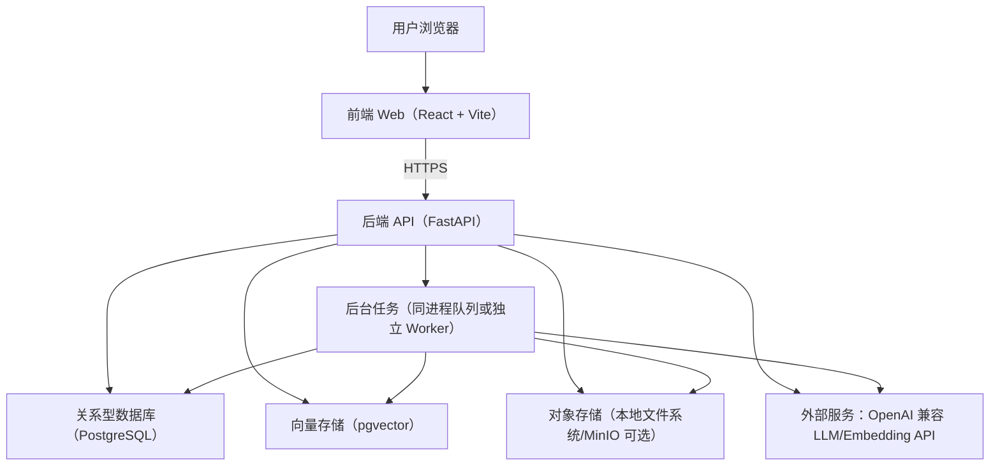
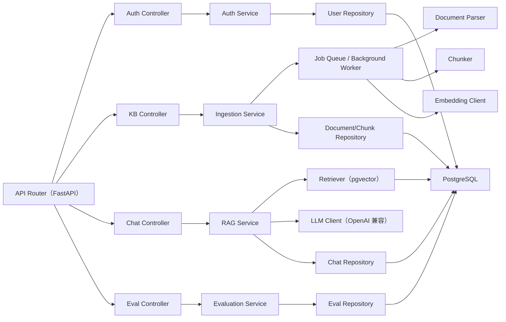
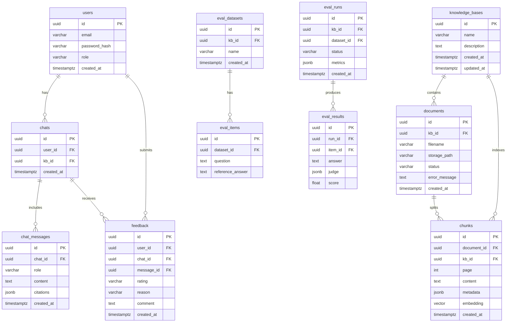

## 1. 架构设计



目标：
- 工程可落地：完整链路（导入→索引→检索→生成→引用→反馈→评测）
- 可替换：LLM Provider、Embedding、向量存储实现可配置
- 可部署：开发环境可 Docker Compose，一键启动；生产环境可拆分 Worker

## 2. 技术选型说明
- 前端：React@18 + TypeScript + Vite + TailwindCSS（界面与交互可快速迭代）
- 后端：Python 3.11（Conda 环境）+ FastAPI + Uvicorn
- 数据库：PostgreSQL（业务数据）+ pgvector（向量检索）
- 文档解析：pdfplumber（PDF）、python-docx（DOCX）、markdown/纯文本解析
- 分块策略：按段落/标题优先，结合最大 token/字符窗口；chunk 元数据带页码/标题路径
- 任务处理：优先“应用内后台任务队列”（满足简历项目可运行）；预留独立 Worker（RQ/Celery）升级路径
- 鉴权：JWT（Access Token）+ 刷新机制（可选）；管理员与普通用户角色
- 可观测：结构化日志 + 请求追踪 id；关键指标（响应时延、无引用率、失败率）

Conda 约定：
- 使用项目级 Conda 环境（如 `citationchat`），锁定 Python 版本与依赖
- 不混用主机其他 Python 版本；命令与脚本默认从该环境执行

## 3. 路由定义
| 路由 | 用途 |
|---|---|
| /login | 登录页（可与主应用同域，或使用弹窗/对话框实现） |
| /chat | 对话页：提问、答案流式输出、引用侧栏 |
| /kb | 知识库页：知识库与文档管理、索引状态 |
| /eval | 评测与设置页：评测集、自动评测、参数配置 |

## 4. API 定义（后端）
统一约定：
- Base URL：`/api`
- 鉴权：`Authorization: Bearer <token>`
- 流式：`text/event-stream`（SSE），前端按 token/片段增量渲染

### 4.1 鉴权
```ts
export type LoginRequest = { email: string; password: string };
export type LoginResponse = { accessToken: string; user: { id: string; email: string; role: "user" | "admin" } };
```
| 方法 | 路径 | 说明 |
|---|---|---|
| POST | /api/auth/login | 登录 |
| POST | /api/auth/logout | 登出（可选） |
| GET | /api/auth/me | 获取当前用户 |

### 4.2 知识库与文档
```ts
export type Kb = { id: string; name: string; description?: string; createdAt: string; updatedAt: string };
export type Document = { id: string; kbId: string; filename: string; status: "uploaded" | "parsing" | "indexed" | "failed"; errorMessage?: string; createdAt: string };
export type UploadDocumentResponse = { documentId: string; status: "uploaded" };
```
| 方法 | 路径 | 说明 |
|---|---|---|
| GET | /api/kbs | 列出知识库 |
| POST | /api/kbs | 创建知识库 |
| PATCH | /api/kbs/:kbId | 修改知识库 |
| POST | /api/kbs/:kbId/documents | 上传文档（multipart/form-data） |
| GET | /api/kbs/:kbId/documents | 文档列表与状态 |
| POST | /api/kbs/:kbId/reindex | 重建索引（异步任务） |

### 4.3 对话与检索
```ts
export type ChatMessage = { role: "user" | "assistant" | "system"; content: string };
export type Citation = { chunkId: string; documentId: string; filename: string; page?: number; score: number; snippet: string };
export type ChatStartRequest = { kbId: string; messages: ChatMessage[]; topK?: number };
export type ChatEvent =
  | { type: "token"; value: string }
  | { type: "citations"; value: Citation[] }
  | { type: "final"; value: { answer: string } }
  | { type: "error"; value: { message: string } };
```
| 方法 | 路径 | 说明 |
|---|---|---|
| POST | /api/chat/stream | SSE：返回 ChatEvent 流（包含引用） |
| GET | /api/chats | 对话历史列表 |
| GET | /api/chats/:chatId | 对话详情（含引用） |

### 4.4 反馈与评测
```ts
export type FeedbackRequest = { chatId: string; messageId: string; rating: "up" | "down"; reason?: string; comment?: string };
export type EvalDatasetItem = { id: string; kbId: string; question: string; referenceAnswer?: string };
export type EvalRunRequest = { kbId: string; datasetItemIds: string[]; judgeModel?: string };
```
| 方法 | 路径 | 说明 |
|---|---|---|
| POST | /api/feedback | 提交反馈 |
| GET | /api/eval/datasets | 评测集列表 |
| POST | /api/eval/datasets/import | 导入评测集（JSON/CSV） |
| POST | /api/eval/runs | 启动评测运行（异步） |
| GET | /api/eval/runs/:runId | 获取评测结果 |

## 5. 服务端架构图


## 6. 数据模型
### 6.1 数据模型定义


### 6.2 数据定义语言（DDL）
```sql
CREATE EXTENSION IF NOT EXISTS vector;

CREATE TABLE users (
  id uuid PRIMARY KEY,
  email varchar(320) UNIQUE NOT NULL,
  password_hash varchar(255) NOT NULL,
  role varchar(16) NOT NULL,
  created_at timestamptz NOT NULL DEFAULT now()
);

CREATE TABLE knowledge_bases (
  id uuid PRIMARY KEY,
  name varchar(120) NOT NULL,
  description text,
  created_at timestamptz NOT NULL DEFAULT now(),
  updated_at timestamptz NOT NULL DEFAULT now()
);

CREATE TABLE documents (
  id uuid PRIMARY KEY,
  kb_id uuid NOT NULL REFERENCES knowledge_bases(id) ON DELETE CASCADE,
  filename varchar(255) NOT NULL,
  storage_path varchar(1024) NOT NULL,
  status varchar(32) NOT NULL,
  error_message text,
  created_at timestamptz NOT NULL DEFAULT now()
);

CREATE TABLE chunks (
  id uuid PRIMARY KEY,
  document_id uuid NOT NULL REFERENCES documents(id) ON DELETE CASCADE,
  kb_id uuid NOT NULL REFERENCES knowledge_bases(id) ON DELETE CASCADE,
  page int,
  content text NOT NULL,
  metadata jsonb NOT NULL DEFAULT '{}'::jsonb,
  embedding vector(1536) NOT NULL,
  created_at timestamptz NOT NULL DEFAULT now()
);

CREATE INDEX idx_chunks_kb_id ON chunks(kb_id);
CREATE INDEX idx_chunks_doc_id ON chunks(document_id);
CREATE INDEX idx_chunks_embedding ON chunks USING ivfflat (embedding vector_cosine_ops);

CREATE TABLE chats (
  id uuid PRIMARY KEY,
  user_id uuid NOT NULL REFERENCES users(id) ON DELETE CASCADE,
  kb_id uuid NOT NULL REFERENCES knowledge_bases(id) ON DELETE CASCADE,
  created_at timestamptz NOT NULL DEFAULT now()
);

CREATE TABLE chat_messages (
  id uuid PRIMARY KEY,
  chat_id uuid NOT NULL REFERENCES chats(id) ON DELETE CASCADE,
  role varchar(16) NOT NULL,
  content text NOT NULL,
  citations jsonb NOT NULL DEFAULT '[]'::jsonb,
  created_at timestamptz NOT NULL DEFAULT now()
);

CREATE TABLE feedback (
  id uuid PRIMARY KEY,
  user_id uuid NOT NULL REFERENCES users(id) ON DELETE CASCADE,
  chat_id uuid NOT NULL REFERENCES chats(id) ON DELETE CASCADE,
  message_id uuid NOT NULL REFERENCES chat_messages(id) ON DELETE CASCADE,
  rating varchar(8) NOT NULL,
  reason varchar(64),
  comment text,
  created_at timestamptz NOT NULL DEFAULT now()
);

CREATE TABLE eval_datasets (
  id uuid PRIMARY KEY,
  kb_id uuid NOT NULL REFERENCES knowledge_bases(id) ON DELETE CASCADE,
  name varchar(120) NOT NULL,
  created_at timestamptz NOT NULL DEFAULT now()
);

CREATE TABLE eval_items (
  id uuid PRIMARY KEY,
  dataset_id uuid NOT NULL REFERENCES eval_datasets(id) ON DELETE CASCADE,
  question text NOT NULL,
  reference_answer text
);

CREATE TABLE eval_runs (
  id uuid PRIMARY KEY,
  kb_id uuid NOT NULL REFERENCES knowledge_bases(id) ON DELETE CASCADE,
  dataset_id uuid NOT NULL REFERENCES eval_datasets(id) ON DELETE CASCADE,
  status varchar(32) NOT NULL,
  metrics jsonb NOT NULL DEFAULT '{}'::jsonb,
  created_at timestamptz NOT NULL DEFAULT now()
);

CREATE TABLE eval_results (
  id uuid PRIMARY KEY,
  run_id uuid NOT NULL REFERENCES eval_runs(id) ON DELETE CASCADE,
  item_id uuid NOT NULL REFERENCES eval_items(id) ON DELETE CASCADE,
  answer text NOT NULL,
  judge jsonb NOT NULL DEFAULT '{}'::jsonb,
  score float NOT NULL
);
```
